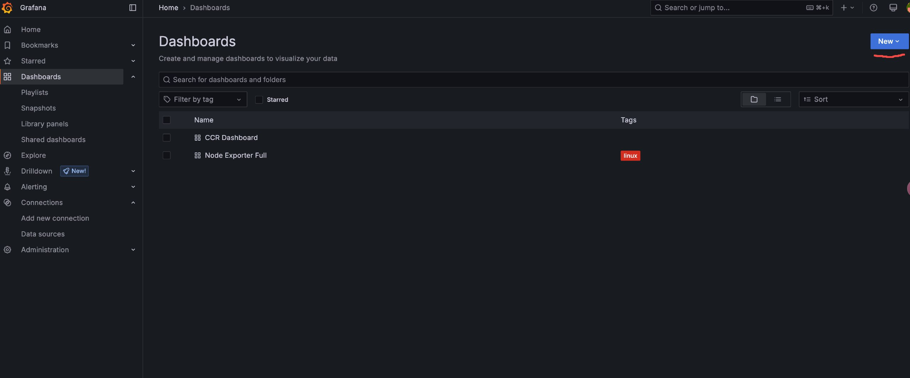
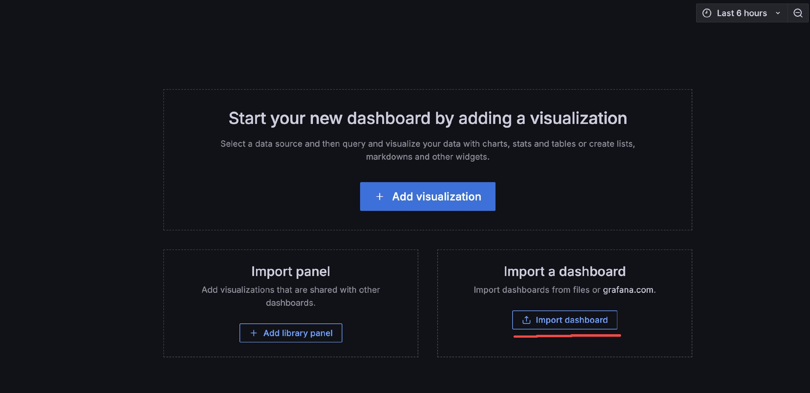
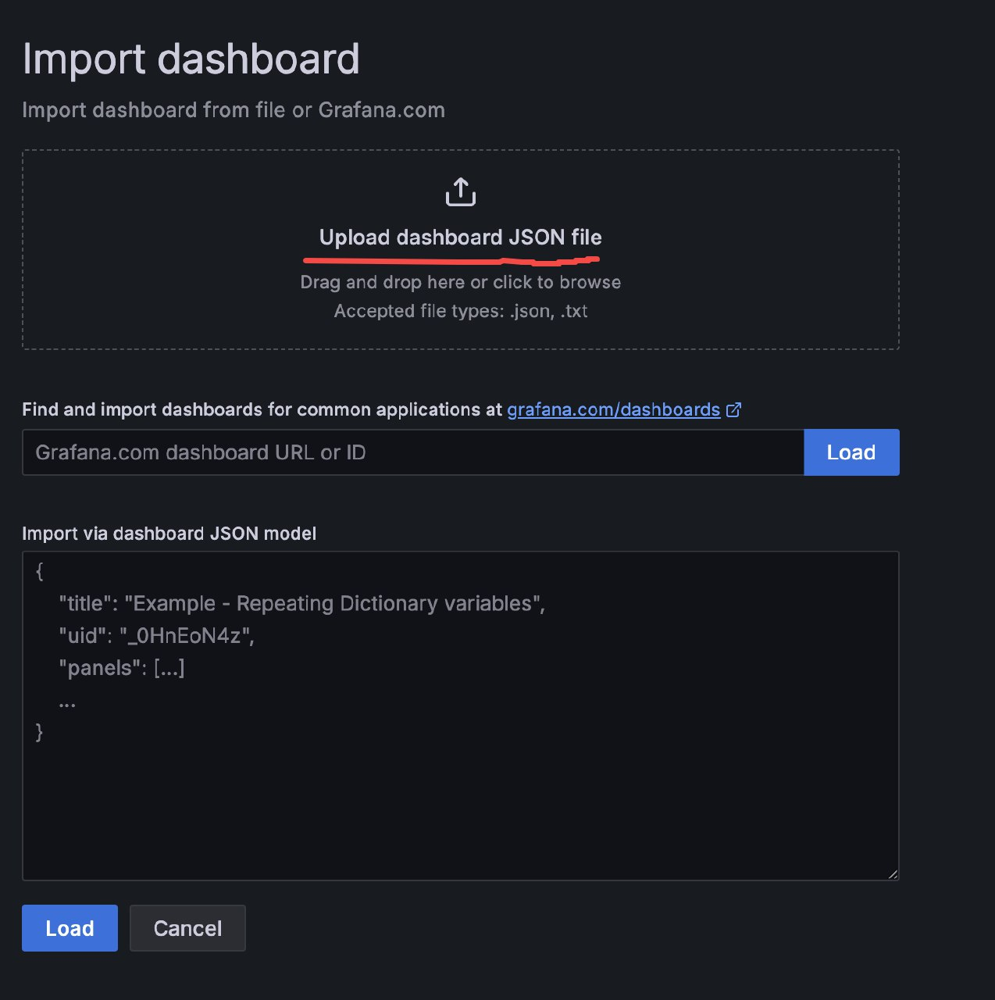
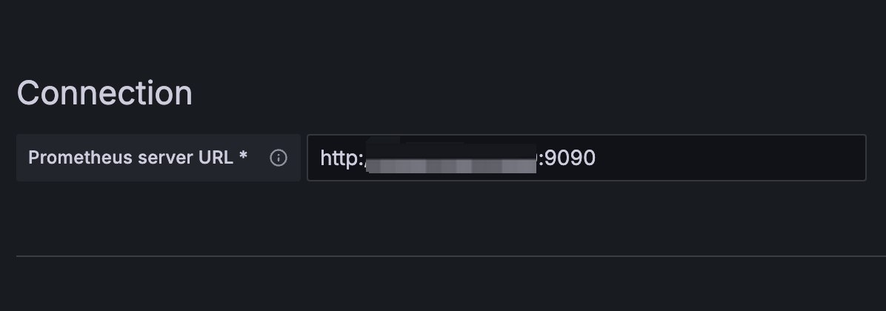

# Dashboard 使用教程
ccr 的`dashboard`主要使用两个工具`Grafana`和`Prometheus`
## Grafana
在`https://grafana.com/grafana/download?pg=graf&plcmt=deploy-box-1`界面选择合适的版本下载Grafana程序，这里使用写文档时的最新版本：
```bash
wget https://dl.grafana.com/enterprise/release/grafana-enterprise-11.6.0.linux-amd64.tar.gz
tar zxvf grafana-enterprise-11.6.0.linux-amd64.tar.gz
```
解压完成后进入目录
```bash
cd grafana-enterprise-11.6.0.linux-amd64
./bin/grafana server
```
这样就在你的机器上启动了Grafana，可以通过浏览器打开，默认端口是3000，你可以看到 login 界面，默认的账号密码都是admin登录之后可以更改密码

这里新建Dashboard，再这里使用import

这里上传`ccr-syncer/dashboard`文件中提供的json文件

创建好之后在左侧选择数据源（Data sources），选择Prometheus，只需要改一个配置

这个url填`http://地址:端口`端口默认9090按情况修改，这一步可以等一会，Prometheus配置好后可以点`Sava&Test`测试一下，当然提前保存也没问题
## Prometheus
可以下载Grafana提供的文件也可以自己选择其他版本`https://prometheus.io/download/`，这里使用写文档时的最新版本
```bash
wget https://github.com/prometheus/prometheus/releases/download/v3.3.0-rc.1/prometheus-3.3.0-rc.1.linux-amd64.tar.gz
tar zxvf prometheus-3.3.0-rc.1.linux-amd64.tar.gz
```
在这里需要修改一下配置，打开`prometheus.yml`文件在下边添加
```bash
  - job_name: 'ccr-syncer'
    static_configs:
      - targets: ['localhost:9190']
```
这里9190是ccr的默认端口，按情况修改，再使用以下命令启动
```bash
./prometheus --config.file=./prometheus.yml
```
可以在浏览器打开，默认端口是9090，执行`up`语句可以看到`up{instance="localhost:9190", job="ccr-syncer"}`这条信息，后边的值是1那么就没问题了

这时候返回Grafana就可以查看ccr的dashboard了